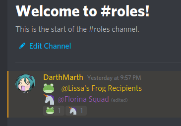
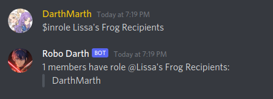
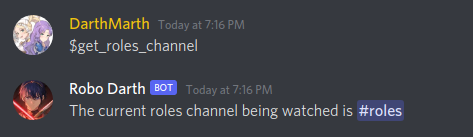
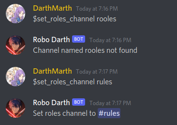

# Role Reaction Bot

This is a very simple, lightweight Discord bot that allows members of a server to add or remove themselves from roles by reacting to messages containing the roles.

## Adding the bot

Visit this URL:

https://discord.com/api/oauth2/authorize?client_id=841007638116433941&permissions=268445760&scope=bot

Select the server you control that you want to add it to and grant the permissions it requests. The bot should show up in the server members.

## How it Works

The bot listens for activity on a channel called (by default) #roles. (This can be changed, see the Commands section below) This channel is assumed to be restricted for most server members so they can't post messages or add reactions.

Specifically, the bot looks for messages in this channel consisting of a series of lines, each containing an emoji and a role mention. When such a message is added or edited, it will automatically add a reaction to the message for each detected emoji. Example:

Users can then add a reaction to any of the generated emoji to be added to/removed from the corresponding role.

### Emoji Note

Use only standard (not custom/uploaded) emoji for the bot. The emoji library used doesn't appear to match up perfectly with the emoji offered by Discord. If you use an emoji the bot doesn't recognize, it will not be added as a reaction to the message. Edit the message and try a different one.

## Commands

### `$inrole`

Enter the command `$inrole`, then the name of a role (do not actually mention it). The bot will list the members that belong to each role.

### `$get_roles_channel`

Checks what the name of the channel being watched for roles is. Defaults to 'roles'

### `$set_roles_channel`

Sets the name of the channel being watched for roles. Enter the channel name as the argument. Only works for members with administrator privileges.

